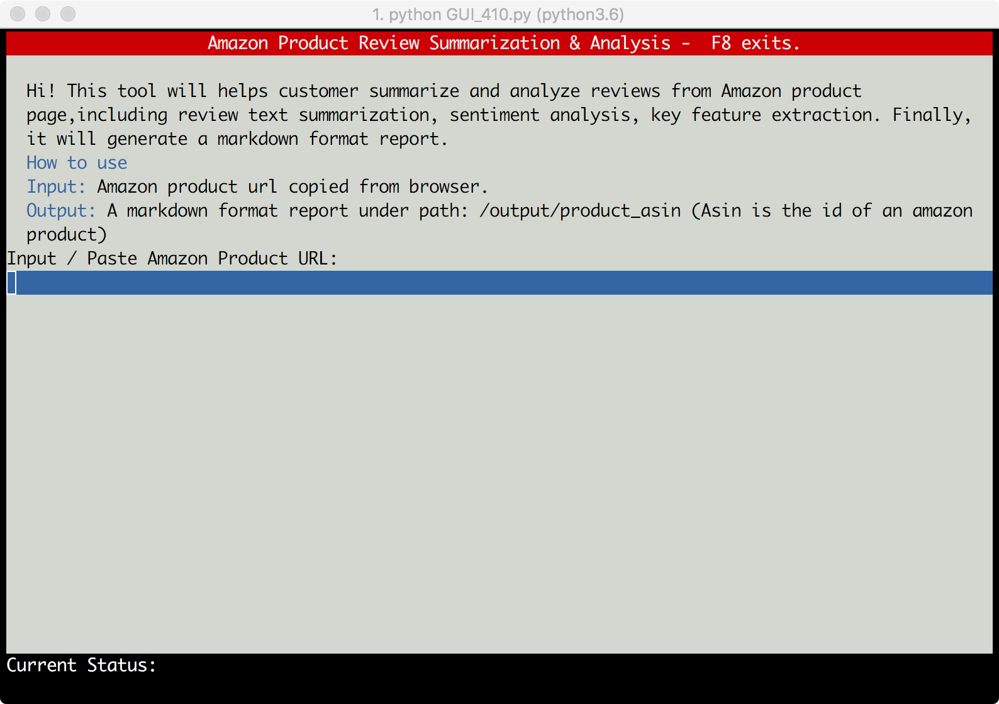
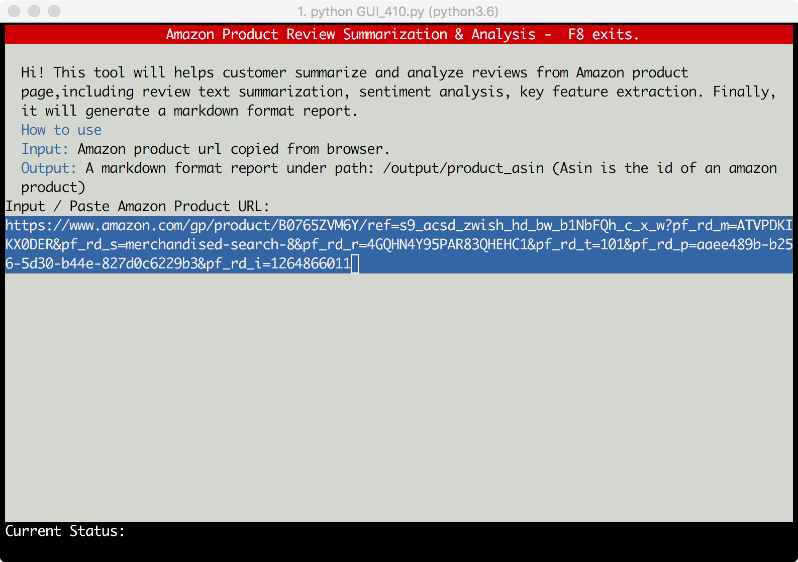
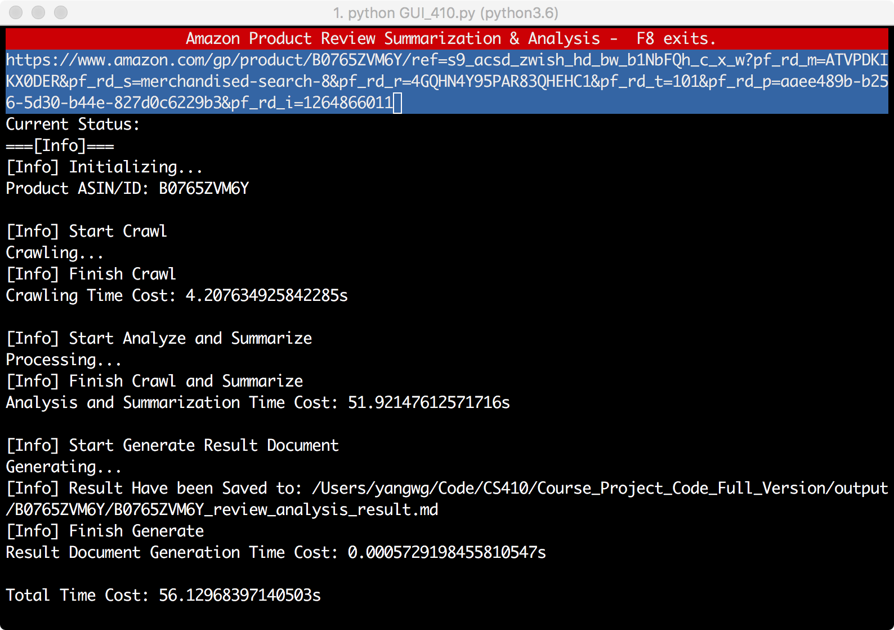

# Report-Review Analyzer for Amazon Electronic Products.

Report for CS410 team project, *software—oriented*.

## Overview of the function

The objective of this project is to give user **purchase suggestions** by **analyzing** and **summarizing** amazon product reviews. 

After input product URL, the code will do the following things:

- Collect product info (name, asin) and reviews (original summary, review text, author, rating)
- Use trained-summarization model summarize review text
- Sentiment analyze review text, divide it into positive, negative
- Extract positive / negative features
- Plot wordcloud
- Aggregate the above results and generate a markdown format document.

## Usage

### File Orginzation 

```
-requirements.txt
-GUI_410.py: Start point of the project
-Main.py: Start point without GUI
-dataset_sample : data_sample directory
-input : Store dataset for training model
-output : Store generated output files
-tmp_data : Store crawled files 
-assert : Store third-party file for model training
-trained_model : Store trained tensorflow model
-util: code related to utility
	-crawl_file_IO_utility.py : handle json, URL 
	-markdown_util.py : Generate Markdown statmemts
	-summarization_part_util.py : read / save pickle files during model build
	-ucsd_dataformat_transformation.py : transform training dataset format
-review_crawler: code related to crawler
	-amazon_crawler.py : third-party crawler
	-amazon_review_crawler.py, wrapper of the crawler
	-crawler_driver.py: driver of the crawler
-review_summarize
	-clean_data.py : cleaning training dataset
	-model_build_and_train.py: construct and train Tensorflow model
	-model_use.py : load trained model, input review_text, output corresponding summarization
	-review_feature_extraction.py: extract reveiw features
	-review_analyze.py  Review Sentiment analysis and WordCloud
	-review_analyze_result_markdown_generate.py: aggregate results, generate markdown document
```

### Input and Output

**Input**：**URL** of a electronic prodect on amazon user is interested in.

**Output**：User will get a **markdown** file，in "/output" directory, including following contents

- Base Info of the product
  - Product ID and Name
  - Positive, neutral, negative review number
  - Mean rating
- Review detail
  - **Positive** review keywords
    - A list of keywords
    - A importance image of keywords
  - Summarization of Each **Positive** Reviews
    - Summary of each customer's 
      - original review and
      - filtered review from analyzer
  - **Negative** review keywords
    - A list of keywords
    - A importance image of keywords
  - Summarization of Each **Negative** Reviews
    - Summary of each customer's 
      - original review and
      - filtered review from analyzer

### How to use


**Step 1:** Install requirement packages using `requirements.txt`

**Step 2**: Download  [numberbatch-en-17.06.txt.gz](https://conceptnet.s3.amazonaws.com/downloads/2017/numberbatch/numberbatch-en-17.06.txt.gz), extract to `./assert/numberbatch-en-17.06.txt`

**Step 3:** Start the program, using `python GUI_410.py`, 



**Step 4:** Input / Paste amazon product URL in the blue box

Test URL

```
https://www.amazon.com/gp/product/B0765ZVM6Y/ref=s9_acsd_zwish_hd_bw_b1NbFQh_c_x_w?pf_rd_m=ATVPDKIKX0DER&pf_rd_s=merchandised-search-8&pf_rd_r=4GQHN4Y95PAR83QHEHC1&pf_rd_t=101&pf_rd_p=aaee489b-b256-5d30-b44e-827d0c6229b3&pf_rd_i=1264866011
```



**Step 5:** Press `Enter` to start the program, waiting for processing



**Step 6:** Press `F8` to exit the program, go to `/output/{product_asin}/{product_asin}_review_analysis_result.json`  see the generated markdown file

### If you want to re-train the summarizatin model, using the following step:

**Step 1** : Collect Dataset, e.g. http://jmcauley.ucsd.edu/data/amazon/, only use `review_text` and `review_summary`

**Step 2:**  Using `/review_summarize/clean_data.py` clean data

**Step 3**: Using `/review_summarize/clean_data.py` training data

## Implementation Detail

### Workflow

#### Model Preparation

1. Collect training dataset
1. Cleaning dataset
1. Construct and train model
1. Save trained model 

#### Analysis Pipeline 

1. Get the URL of the product's website from user
2. Retrieve information from the website.
3. Apply trained Review Summarization Model to the review contents getten from website. 
4. Sentiment analysis and feature extraction.
5. Summarize the results and export hem to report, the Markdown file.

### Detail Part

#### Data Set

Amazon product data http://jmcauley.ucsd.edu/data/amazon, we use the 5-core Electronics dataset.

#### Data Clean

We did the following thing.

- Clean null value
- Convert to lower case
- Replace contractions
- Remove stopwords
- Get word-to-int, int-to-word dictionary

Library Used: `numpy`, `pandas`, `nltk`

#### Model Build and Train

Build a review summarization model using  **RNN** and **LSTM**, implement it using ` tensorflow`

#### Crawl Review

Using a third-party crawler to help collect reviews.

For each product, collect:

- asin- ID of the product
- Product name-name of the product
- review
  - original_summary-summary of the review
  - Review_text-text of the review
  - author-name of the reviewer
  - Rating - rating of the product

The crawled review info will be saved in a `json` file

#### Review Summarize

- Load trained model
- clean input data
- Covert input reveiew str to int for model use
- Summarize
- Conver int back to str

#### Sentiment Analysis and Feature Extraction

Using `textblob` for sentiment evaluation 

Using `wordcloud` plot wordcloud

Using third-party code for feature Extraction

#### GUI

Using `urwid` 

## Group Member and Contribution

### Group Member

- Xing Han(xingh3) 
- Weiguang Yang(wy7) 
- Dongfan Li(dongfan2)

### Contribution

#### Xing Han (xingh3)

- Adapt third-party review crawler, 
- Collect dataset for Review summarization model training

#### Dongfan Li (dongfan2)

- Training data cleaning
-  Summarization model build and training

#### Weiguang Yang (wy7)

- Sentiment analysis and feature extraction
- Result aggregation and Document generation
- GUI
